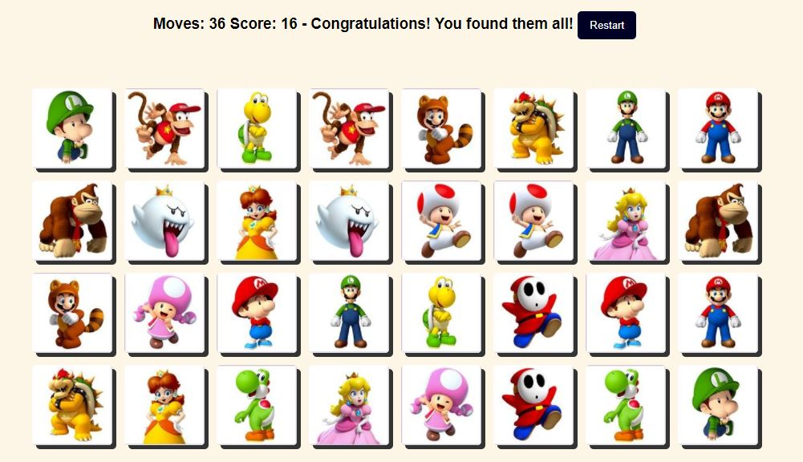

# Memory Game
A Grid-based Memory game in vanilla JavaScript, HTML and CSS

Memory Game, also known as the Concentration card game or Matching Game, is a simple card game where you need to match pairs by turn over 2 cards at a time.

[Live URL](https://h4haris.github.io/memory-game) 

## Rules of Memory Game
- You will start by flipping over one card
- If the next card you flip matches, you get +1 to your score
- These cards then appear flipped
- If the next card you flip does not match, then both cards flip back
- The game continues until you match all the cards on the board
- At then end, you can see total score in total performed moves
- You can restart game once finished

### Reference
[https://www.youtube.com/watch?v=lhNdUVh3qCc](https://www.youtube.com/watch?v=lhNdUVh3qCc) 
